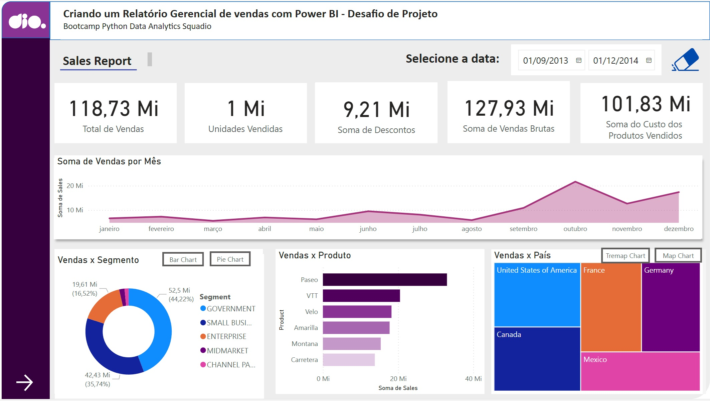
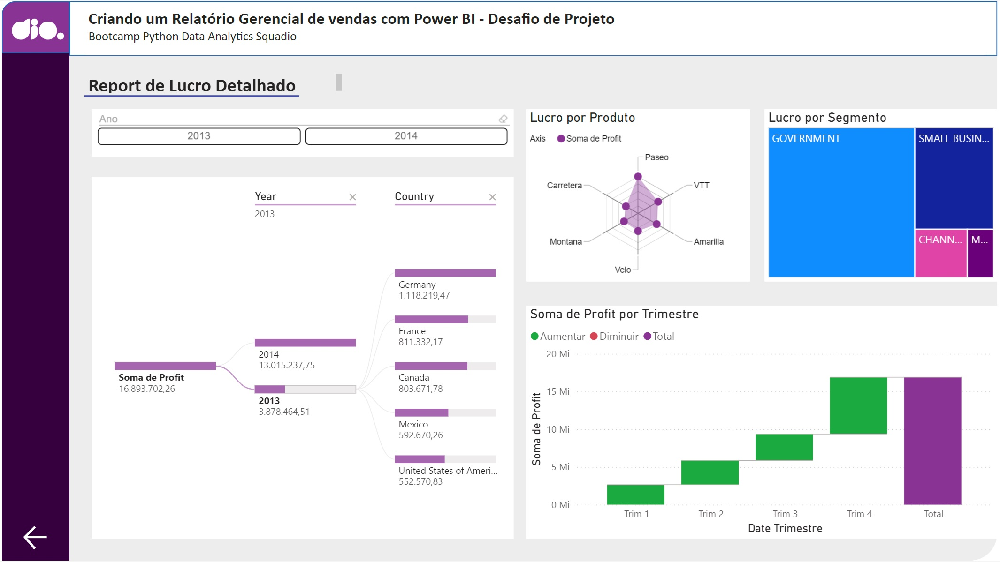

# relatorio-gerencial-vendas
Desafio de projeto do Bootcamp Python Data Analytics Squadio

Criando Um Relatório Gerencial de Vendas com Power BI

Para iniciar, carreguei os dados de amostra "Financials" no Power BI. Em seguida, acessei a opção "Transformar Dados" para verificar a consistência dos dados.

Durante essa análise, observei que os valores de vendas brutas (gross sales) estavam com casas decimais. Para simplificar, arredondei esses valores para cima. Além disso, padronizei a formatação dos dados de segmento (segment) e nome do mês (month name), convertendo-os para maiúsculas, a fim de destacar essas informações no relatório.

